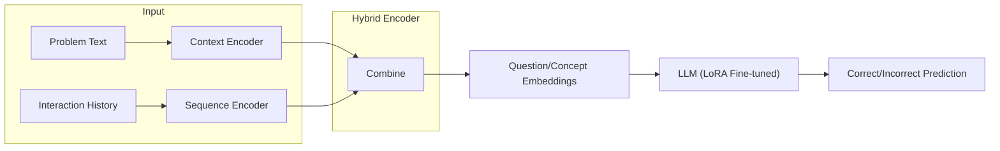

# LLM-KT: Knowledge Tracing with Large Language Models

A Knowledge Tracing model that combines dual encoders (Context + Sequence) with fine-tuned LLMs to predict student performance on learning tasks.

## Architecture



**Key Components:**
- **Context Encoder**: Multilingual BERT-base (`intfloat/multilingual-e5-base`) for encoding problem text and concepts
- **Sequence Encoder**: Transformer encoder for capturing temporal patterns in student history
- **LLM Integration**: Fine-tuned LLMs (Phi-3, Qwen, Llama2) with LoRA adapters

## Dataset

Uses the **MOOCRadar** dataset containing:
- `problem.json`: ~9.3K problems with Chinese text content, options, and concepts
- `student-problem-coarse-flattened.json`: ~9.9M student interaction logs

## Quick Start

### 1. Install Dependencies

```bash
pip install torch transformers peft tqdm numpy scikit-learn
```

### 2. Prepare Data

```bash
python prepare_data.py \
    --problems-path dataset/MOOCRadar/problem.json \
    --interactions-path dataset/MOOCRadar/student-problem-coarse-flattened.json \
    --output-dir processed/ \
    --max-seq-len 200 \
    --seed 42
```

For quick testing with limited data:
```bash
python prepare_data.py --preset small --output-dir processed/small
```

### 3. Train Model

```bash
# Using pre-processed data (recommended)
python train.py --preset small --processed-dir processed/small --epochs 5

# Or directly from raw JSON
python train.py --preset small --epochs 5
```

### 4. Test Model

```bash
python test.py --checkpoint checkpoints/best_model
```

## Configuration Presets

| Preset | Description | Use Case |
|--------|-------------|----------|
| `small` | Minimal config, fast training | Testing & debugging |
| `standard` | Balanced settings | General use |
| `phi3` | Microsoft Phi-3 model | Production |
| `qwen` | Qwen model | Production |
| `llama2` | Llama 2 model | Production |

```bash
# Use a preset
python train.py --preset phi3

# Override specific settings
python train.py --preset phi3 --batch-size 4 --lr 1e-4
```

## Project Structure

```
LLM-KT/
├── prepare_data.py      # Data preparation CLI
├── train.py             # Training CLI
├── test.py              # Testing script
├── config.py            # Configuration presets
├── models/
│   ├── encoders.py      # Context & Sequence encoders
│   └── kt_llm.py        # LLM integration
├── utils/
│   ├── data_loader.py   # Dataset classes
│   └── concept_mapping.py
└── dataset/
    └── MOOCRadar/       # Raw data files
```

## CLI Reference

### prepare_data.py

```bash
python prepare_data.py --help
```

Key arguments:
- `--problems-path`: Path to problem.json
- `--interactions-path`: Path to student interactions
- `--output-dir`: Output directory for processed data
- `--train-ratio` / `--val-ratio`: Dataset split ratios
- `--max-seq-len`: Maximum sequence length
- `--preset`: Use preset configuration

### train.py

```bash
python train.py --help
```

Key arguments:
- `--preset`: Model preset to use
- `--processed-dir`: Pre-processed data directory
- `--epochs`: Number of training epochs
- `--batch-size`: Training batch size
- `--lr`: Learning rate
- `--wandb`: Enable Weights & Biases logging

## Notebook Demo

For demonstrations and exploration, see `main.ipynb`. The notebook provides:
- Interactive data exploration
- Step-by-step model building
- Visualization of results

> **Note**: CLI (`prepare_data.py` + `train.py`) is recommended for production training.
